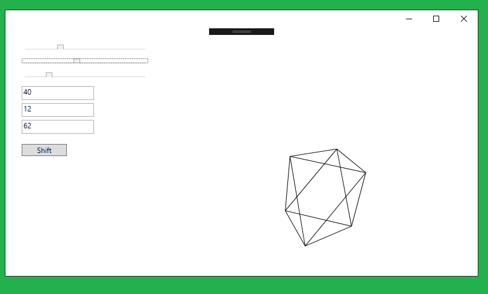
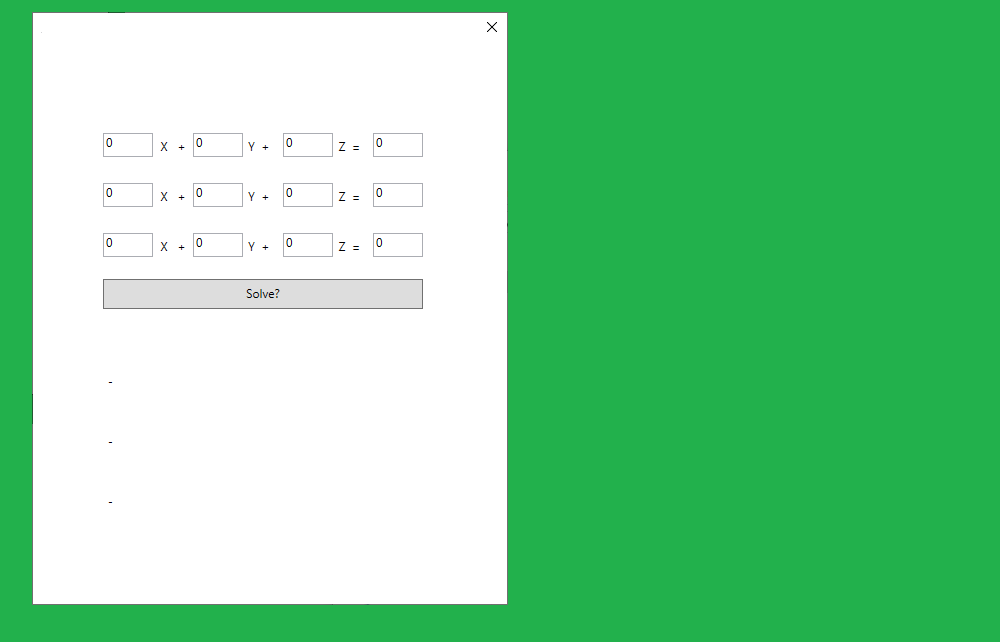
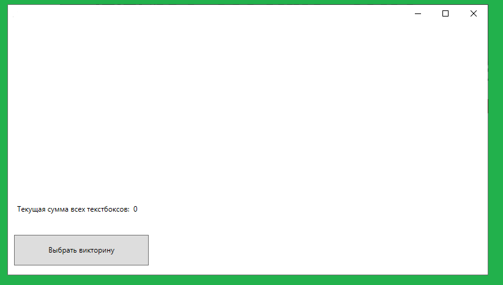
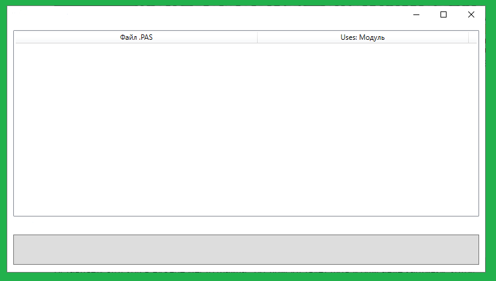

# Студенческие проекты

**RotationMatrix project:**
Задача была написать программу, которая будет выводить на экран проекцию правильного октаэдра на плоскость.
При этом должна быть возможность управлять вращением этой фигуры вокруг оси x; оси y; оси z
(по отдельности), а также сдвигать ее в разные стороны по всем трем осям.

**Matrix project:**
Задача была написать программу для решения системы трех линейных уравнений с тремя неизвестными. Результатом решения
должно быть полное описание множества решений системы (даже если их бесконечно много).

**CreateTB project:**
Текст задачи: В файле, в удобном вам формате, записаны расположение элементов управления TextBox. После
запуска программы и выбора файла, эти элементы управления появляются на экране; и после каждого
изменения чисел, хранящихся в TextBox, на форме в Label появляется сумма введенных чисел.

**ValidFile project:**
Текст задачи: Пользователь указывает основной файл исходного кода программы на языке Паскаль. После чего
в TListView для каждого файла исходного кода этой программы указывается какие модули в нем
явно используются (подключены с помощью uses). Программа должна анализировать всю иерархию
подключенных модулей, исходник которых расположены в том же каталоге, что сама программа.

